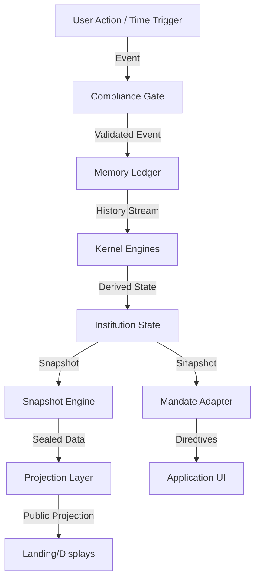

<!-- IRON DOCUMENTATION BADGE -->

  <table style="border: 1px solid #333; background: #0A0D12; width: 100%; border-collapse: collapse; font-family: monospace;">
    <tr>
      <td style="border-right: 1px solid #333; padding: 10px; color: #505050; width: 25%;">CLASS</td>
      <td style="border-right: 1px solid #333; padding: 10px; color: #e0e0e0; width: 25%; font-weight: bold;">ARCHITECTURE</td>
      <td style="border-right: 1px solid #333; padding: 10px; color: #505050; width: 25%;">AUTHORITY</td>
      <td style="padding: 10px; color: #5BC0DE; width: 25%; font-weight: bold;">DESCRIPTIVE</td>
    </tr>
    <tr>
      <td style="border-right: 1px solid #333; border-top: 1px solid #333; padding: 10px; color: #505050;">ENFORCEMENT</td>
      <td style="border-right: 1px solid #333; border-top: 1px solid #333; padding: 10px; color: #e0e0e0;">NONE</td>
      <td style="border-right: 1px solid #333; border-top: 1px solid #333; padding: 10px; color: #505050;">STATUS</td>
      <td style="border-top: 1px solid #333; padding: 10px; color: #5BC0DE;">ACTIVE</td>
    </tr>
  </table>

<!-- END BADGE -->

# DATA FLOW SPECIFICATION
## The Unidirectional Flow of Truth

### 1. THE TRUTH PIPELINE
Data flows in exactly one direction. No loopbacks. No side-channels.

### 2. TRAFFIC RULES

#### Rule 1: No Upstream Reads
The UI reads the Adapter. The Adapter reads the Store. The Engines read the Ledger.
**NEVER**: UI reading the Ledger directly.

#### Rule 2: No Downstream Writes
The Kernel writes to the Ledger.
**NEVER**: UI writing to the Ledger or Store.

### 3. EVENT TYPES
1.  **Intake Events**: `USER_INDUCTED`, `SESSION_LOGGED`, `CLOCK_TICK`.
2.  **Internal Events**: `STANDING_CHANGED`, `BREACH_DECLARED`.
3.  **Mandate Events**: `UI_THEME_UPDATE`, `NAVIGATION_LOCK`.
