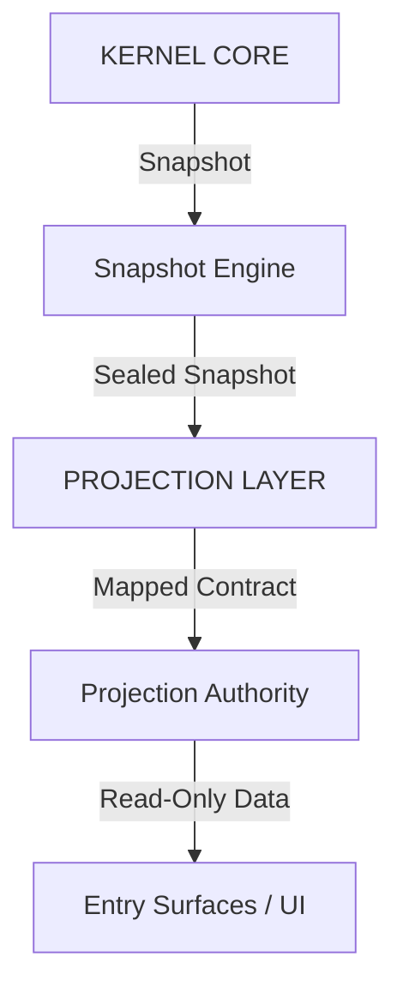

<!-- IRON DOCUMENTATION BADGE -->

  <table style="border: 1px solid #333; background: #0A0D12; width: 100%; border-collapse: collapse; font-family: monospace;">
    <tr>
      <td style="border-right: 1px solid #333; padding: 10px; color: #505050; width: 25%;">CLASS</td>
      <td style="border-right: 1px solid #333; padding: 10px; color: #e0e0e0; width: 25%; font-weight: bold;">ARCHITECTURE</td>
      <td style="border-right: 1px solid #333; padding: 10px; color: #505050; width: 25%;">AUTHORITY</td>
      <td style="padding: 10px; color: #5BC0DE; width: 25%; font-weight: bold;">DESCRIPTIVE</td>
    </tr>
    <tr>
      <td style="border-right: 1px solid #333; border-top: 1px solid #333; padding: 10px; color: #505050;">ENFORCEMENT</td>
      <td style="border-right: 1px solid #333; border-top: 1px solid #333; padding: 10px; color: #e0e0e0;">NONE</td>
      <td style="border-right: 1px solid #333; border-top: 1px solid #333; padding: 10px; color: #505050;">STATUS</td>
      <td style="border-top: 1px solid #333; padding: 10px; color: #5BC0DE;">ACTIVE</td>
    </tr>
  </table>

<!-- END BADGE -->

# KERNEL PROJECTION LAYER (KPL-01)
## Read-Only Sovereign Surface Architecture

### PURPOSE
The Kernel Projection Layer (KPL) exists to expose verifiable institutional state to non-governing surfaces (landing page, public entry chambers) without allowing mutation, bypass, or simulation.
It answers only one question: **“What is the system’s current constitutional reality?”**

### 1. CONSTITUTIONAL POSITION
The KPL is:
*   Downstream of the Kernel.
*   Upstream of all read-only surfaces.
*   Incapable of State Mutation.
*   Incapable of Simulation.

It is a projection boundary, not an interface. No UI may query the kernel directly.

### 2. ARCHITECTURE

### 3. CORE COMPONENTS

#### 3.1 Kernel Snapshot Engine (KSE)
*   **Role**: Generate immutable, structured representations of state.
*   **Responsibility**: Subscribe to Event Bus, Seal Snapshots, Hash Content.
*   **Output**: `KernelSnapshot` (Immutable).

#### 3.2 Projection Authority Layer (PAL)
*   **Role**: Enforce read-only sovereignty.
*   **Responsibility**: Filter views, Redact mechanics, Prevent elevation.
*   **Interface**: `getInstitutionState()`, `getStandingProjection()`.

#### 3.3 Constitutional Schema Layer
*   **Role**: Validate Projections.
*   **Constraint**: Nothing may appear unless explicitly permitted by Schema.

#### 3.4 Projection Cache
*   **Role**: Buffer Kernel pressure.
*   **Behavior**: Serve last valid snapshot if Kernel is busy or offline.

### 4. DATA CONTRACTS

#### 4.1 Institutional State
*   `lifecycle`: ACTIVE | DEGRADED | SUSPENDED
*   `standing`: SOVEREIGN | AT_RISK | NON_COMPLIANT
*   `integrity`: INTACT | BREACHED

#### 4.2 Sovereignty Signal
*   `sovereign`: boolean
*   `lastVerdict`: PASS | FAIL
*   `enforcementHealth`: NOMINAL | DEGRADED

### 5. FAILURE MODES
If the Kernel is unreachable:
*   Cache serves last known truth.
*   UI enters **"INSTITUTION UNAVAILABLE"** mode.
*   **Silence is preferred to fiction.**

### 6. SUCCESS CONDITION
The Landing Page renders ONLY what the Kernel projects.
It presents. It does not claim.
